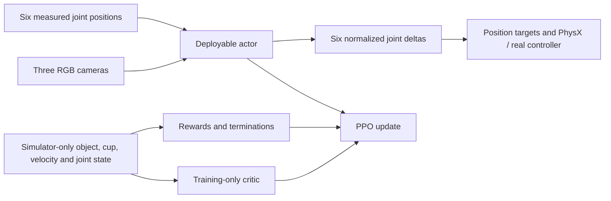

# SO-101 reinforcement-learning methodology

This document explains the design behind the SO-101 object-in-cup tasks, the
reward and termination logic, the currently supported training algorithm, the
neural networks, and the extension process for creating a new task or model.
For commands to prepare assets, launch Isaac Sim, train, play, export, and run
the real-robot node, use [README.md](README.md).

## What is implemented, and what is not

This repository is an external Isaac Lab project. It owns the task, assets,
manager terms, RSL-RL configuration, custom visual actor, export contract, and
ROS 2 inference adapter. Isaac Lab supplies the vectorized environment,
managers, PhysX simulation, rendering, and RL integration.

The following distinction is important:

- **Implemented now:** single-agent RSL-RL PPO for the state and three-camera
  visual tasks.
- **Available in Isaac Lab but not wired into these tasks:** the `rl_games`,
  `skrl`, `sb3`, and `rlinf` backends. Selecting one on the command line is not
  enough; that backend needs its own task registration, agent configuration,
  model, observation mapping, checkpoint handling, and deployment export.
- **Not currently implemented:** SAC, TD3, behavior cloning, offline RL,
  recurrent policies, or a multi-agent formulation.

Do not treat an RL backend as an interchangeable algorithm switch. The current
three-camera network and `isaaclab/export` command implement the RSL-RL model
interfaces specifically.

## Training methodology

The development sequence is deliberately staged so a visual-policy failure is
not confused with a physics, geometry, reward, or control failure.

1. **Validate geometry and control.** Confirm the cup opening is not sealed by
   collision geometry, the cube fits, contacts are stable, joint order and
   limits are correct, and normalized actions move the expected joints.
2. **Use the state task as a physics/reward baseline.** It removes visual
   representation learning from the problem. If this task cannot learn, do not
   tune the camera CNN.
3. **Overfit the fixed visual task.** Train
   `SO101-Object-In-Cup-Vision-Fixed-v0` with deterministic resets, nominal
   cameras and materials, and no latency or observation corruption. This tests
   whether the three images contain enough information and whether the visual
   actor can optimize the task.
4. **Introduce randomized training.** Resume the accepted fixed checkpoint on
   `SO101-Object-In-Cup-Vision-v0`. Randomization is for robustness after the
   nominal behavior exists, not a substitute for a learnable nominal task.
5. **Evaluate held-out conditions.** Use seeds and perturbations that were not
   used to select checkpoints. Report success rate, not just mean reward.
6. **Verify export parity.** The checkpoint, TorchScript actor, and ONNX actor
   must produce numerically equivalent deterministic actions for the same
   observations.
7. **Validate real inputs in shadow mode.** Check timestamps, preprocessing,
   action bounds, and failure behavior before enabling command publication.

The acceptance targets remain 95% success for the fixed visual task and 90%
over 1,000 held-out randomized visual episodes before real-robot arming. These
are gates to measure; they are not results already achieved by the code.

## Environment and control loop

Every Isaac Lab process owns `N` cloned environments. Physics is stepped at
100 Hz (`sim.dt = 0.01 s`). The environment decimation is five, so the policy,
reward, termination checks, and camera updates run at 20 Hz (`0.05 s`). A
15-second episode therefore contains at most 300 policy steps.

The six action values use this canonical order:

```text
shoulder_pan, shoulder_lift, elbow_flex, wrist_flex, wrist_roll, gripper
```

For policy output `a_t` clipped to `[-1, 1]`, the position target is:

```text
arm target       = measured arm position + 0.05 * a_t
gripper target   = measured gripper position + 0.15 * a_t
```

Isaac Sim's articulation constraints enforce the simulated joint limits. The
ROS deployment adapter separately clips the resulting absolute targets to the
URDF limits with its safety margin. This is a joint-position-delta controller,
not a torque controller. It intentionally matches the deployment adapter, which
constructs absolute controller targets from the most recent measured positions.

The randomized vision task samples zero or one policy step of action latency.
The fixed task has no action latency.

## Observation and information boundaries

### State baseline

`SO101-Object-In-Cup-v0` concatenates a 35-value state vector for both actor and
critic:

| Term | Width | Meaning |
|---|---:|---|
| Relative joint position | 6 | Position relative to the default pose |
| Relative joint velocity | 6 | Six joint velocities |
| Previous action | 6 | Previous normalized policy action |
| Gripper-to-object delta | 3 | Object position minus grasp-frame position |
| Object-to-cup delta | 3 | Object position minus cup position |
| Object orientation | 4 | Quaternion |
| Object velocity | 6 | Linear and angular velocity |
| Gripper position | 1 | Absolute gripper joint position |
| **Total** | **35** | |

This is a debugging and task-learnability baseline. It cannot be deployed as-is
because the real robot does not directly measure the object and cup states.

### Deployable visual actor

The visual actor receives exactly four groups:

```text
joint_state  [N, 6]            absolute joint positions in radians
wrist       [N, 3, 120, 160]  RGB / 255 - 0.5
overhead_1  [N, 3, 120, 160]  RGB / 255 - 0.5
overhead_2  [N, 3, 120, 160]  RGB / 255 - 0.5
```

It does not receive joint velocity, previous action, object pose, cup pose,
object velocity, reward phase, or a success flag. The camera and joint group
names are bound to the actor in
[`rsl_rl_vision_ppo_cfg.py`](source/so101_rl/so101_rl/tasks/object_in_cup/agents/rsl_rl_vision_ppo_cfg.py).

### Asymmetric training-only critic

The visual critic receives the same 35 simulator-state values used by the state
baseline. This is asymmetric actor-critic training: simulator truth helps the
value function estimate returns, but it never enters the actor. At deployment,
only the actor is exported, so privileged critic information cannot leak into
the real policy.



When changing observations, preserve this boundary deliberately. An observation
available in simulation is not automatically a valid actor input.

## Reward design

The reward is a dense sequence of task incentives plus two smoothness
penalties. Let:

- `p_o`, `p_c`, and `p_e` be object, cup, and end-effector positions;
- `d_eo = ||p_o - p_e||`;
- `r_oc = ||(p_o - p_c)_xy||`;
- `z_oc = (p_o - p_c)_z`;
- `q_g` be the gripper joint position, where larger values are more open;
- `v_o` and `w_o` be object linear and angular velocity;
- `a_t` be the normalized action.

The generated asset manifest supplies the placement geometry. For the current
cube and cup it contains approximately:

```text
xy_tolerance    = 0.003860 m
center_z_min    = 0.014498 m
center_z_max    = 0.038500 m
```

These values are loaded from `build/isaaclab_assets/manifest.json` at task
configuration time. Rebuilding different object or cup assets can change them.

### Configured terms

| Term | Raw value | Weight | Purpose |
|---|---|---:|---|
| Reach | `1 - tanh(d_eo / 0.06)` | `+1.0` | Bring the grasp frame to the object |
| Grasp | `1[d_eo <= 0.035 and q_g <= 0.45]` | `+0.5` | Close the gripper near the object |
| Lift | `clip((p_o.z - p_c.z) / 0.075, 0, 1)` | `+2.0` | Raise the object from the table |
| Transport | `(1 - tanh(r_oc / 0.08)) * 1[z_oc >= 0.045]` | `+3.0` | Align the lifted object over the cup |
| Insertion | vertical progress times `1[r_oc <= xy_tolerance]` | `+5.0` | Lower an aligned object below the rim |
| Release | `1[inside cup and q_g >= 1.20]` | `+8.0` | Open the gripper after insertion |
| Stable | `1[released, inside, and slow]` | `+20.0` | Reward a physically settled placement |
| Action rate | `||a_t - a_(t-1)||^2` | `-0.02` | Discourage abrupt action changes |
| Joint velocity | `||joint_velocity||^2` | `-0.0005` | Discourage unnecessary fast motion |

For insertion, vertical progress is:

```text
clip((0.090 - z_oc) / (0.090 - center_z_max), 0, 1)
```

The stable-placement mask requires all of the following:

```text
r_oc <= xy_tolerance
center_z_min <= z_oc <= center_z_max
||v_o|| <= 0.025 m/s
||w_o|| <= 0.50 rad/s
q_g >= 1.20 rad
```

Isaac Lab treats configured reward weights as rates. The reward returned on one
policy step is:

```text
reward_t = 0.05 * sum(weight_i * raw_term_i)
```

This factor matters when comparing logged returns with a hand calculation or
when changing the policy frequency.

### Why the reward is staged

A success-only reward would require random exploration to discover a complete
reach-grasp-lift-align-insert-release sequence. The dense terms provide useful
gradients before success is observed. The high release and stable weights keep
the optimum focused on completing the task rather than hovering near the
object or cup.

The stage terms are not a scripted state machine. All active terms are computed
every step from physical state. For example, transport is height-gated and
insertion is alignment-gated, but there is no hidden phase supplied to the
actor.

### Reward limitations to watch

- `grasp` detects proximity and gripper closure, not finger contact. A policy
  can receive it without a mechanically secure grasp.
- `lift` rewards object height regardless of why the object moved.
- `transport` can encourage hovering over the cup if the release and stable
  terms are too difficult to reach.
- The current insertion alignment tolerance is geometry-derived and narrow.
  If learning stalls at alignment, inspect trajectories before widening it;
  changing it also changes what the reward calls “inserted.”
- Large smoothness penalties can suppress the motion needed to finish within
  15 seconds. Small penalties should be tuned after task progress is visible.

Always inspect per-term episode metrics (`Episode_Reward/<term>`) and actual
trajectories. A rising total reward alone does not prove the intended behavior.

## Success and termination

An episode terminates under four conditions:

| Condition | Definition |
|---|---|
| Success | Stable-placement mask remains true for 10 consecutive policy steps |
| Dropped | Object world height is below `-0.02 m` |
| Invalid | Object root state or robot joint position/velocity contains NaN or Inf |
| Timeout | 15 seconds, or 300 policy steps |

Ten steps at 20 Hz is a 0.5-second settling window. The counter resets to zero
as soon as any placement condition becomes false. A transient pass through the
cup therefore cannot be counted as success.

Timeout is marked as truncation rather than physical failure, which allows the
RL runner to bootstrap the value estimate correctly.

## Resets, curriculum, and domain randomization

The fixed visual task disables reset variation, material and actuator
randomization, camera perturbation, image corruption, and camera/action
latency. It exists to answer one question: can the nominal visual task learn?

The randomized task includes:

- object and cup XY reset offsets;
- object yaw;
- object mass;
- object and cup friction/restitution;
- actuator stiffness and damping response;
- joint reset and joint-observation noise;
- camera position, rotation, and FOV;
- object, cup, and table appearance;
- lighting, exposure, contrast, RGB gain, and Gaussian image noise;
- zero/one-step camera and action latency.

Layout variation grows linearly with `env.common_step_counter` over 30,000,000
environment steps. The object XY half-range grows from 4 mm to 25 mm and cup XY
half-range from 3 mm to 20 mm; object yaw grows to the full `[-pi, pi]` range.
Startup-only physics randomization is sampled when the environment process is
created, while reset events are sampled per episode.

Randomization ranges are hypotheses about real variation, not proof of transfer.
Ranges that are too narrow produce a brittle policy; ranges that are too broad
can make early optimization fail. Record real camera, timing, friction, and
actuator measurements and revise the ranges from evidence.

## Neural-network architecture

### State actor and critic

The state task uses independent MLP actor and critic networks with hidden widths
`[256, 256, 128]`, ELU activations, and observation normalization. The actor
outputs the mean of a six-dimensional Gaussian action distribution initialized
with standard deviation `0.7`.

### Three-camera actor

Each camera is encoded independently; weights are not shared between views.
For each `[3, 120, 160]` image the encoder is:

```text
Conv2d(3 -> 16, kernel=8, stride=4)   + ELU
Conv2d(16 -> 32, kernel=4, stride=2)  + ELU
Conv2d(32 -> 32, kernel=3, stride=1)  + ELU
SpatialSoftmax(32 feature maps)       -> 64 XY values
```

With no padding, the last feature map is `[32, 11, 16]`. Spatial softmax turns
each channel into its expected normalized `(x, y)` location, so each camera
contributes 64 values. The three camera latents contribute 192 values; six
normalized joint positions produce a 198-value fused latent. The actor head is
an ELU MLP with widths `[512, 256, 128]` and a six-value Gaussian output.

Spatial softmax was chosen because object-in-cup control depends strongly on
where visual features are located. It also avoids feeding a large flattened
feature map to the MLP. It does not guarantee that the learned keypoints
correspond to the cube, cup, or gripper; render inspection and saliency/keypoint
analysis are still useful diagnostics.

The visual critic is an MLP with widths `[256, 256, 128]` over its privileged
35-value input. The exported actor uses the deterministic Gaussian mean, not a
sampled training action.

The implementation is in
[`models.py`](source/so101_rl/so101_rl/tasks/object_in_cup/agents/models.py).
Its `as_jit()` and `as_onnx()` methods define the deployment signatures used by
`isaaclab/export`.

## PPO configuration and update

PPO is an on-policy actor-critic algorithm. The runner collects trajectories
using the current stochastic actor, estimates advantages with generalized
advantage estimation (GAE), and performs several minibatch epochs while
clipping how far the new policy can move from the rollout policy.

For the visual tasks:

| Parameter | Value |
|---|---:|
| Rollout length | 32 steps/environment |
| Learning epochs/rollout | 5 |
| Minibatches/epoch | 8 |
| Learning rate | `7e-5`, fixed |
| Discount `gamma` | `0.99` |
| GAE `lambda` | `0.95` |
| PPO clip | `0.2` |
| Value-loss coefficient | `1.0` |
| Entropy coefficient | `0.005` |
| Initial action standard deviation | `0.7` |
| Maximum gradient norm | `1.0` |
| Checkpoint interval | 250 iterations |
| Maximum iterations | 15,000 |

With 64 environments, one process collects `64 * 32 = 2,048` transitions per
iteration. Rendering three cameras in every environment usually limits the
practical environment count before the PPO arithmetic does.

Two-GPU training is data parallel. `torchrun` launches one process per GPU; each
process owns a complete actor, critic, optimizer, and local 64-environment
simulation batch. RSL-RL broadcasts the initial parameters and averages
gradients across ranks after each PPO minibatch. The model is replicated, not
sharded, so two GPUs produce 128 simulated environments and 4,096 transitions
per distributed rollout. RSL-RL implements the synchronization directly rather
than wrapping the models in PyTorch's `DistributedDataParallel` class, but the
architecture and update are replicated data parallel: one full model per GPU
and one averaged gradient update across all replicas.

For the local source-built Isaac Sim runtime, the repository initializes the
real NCCL training group before Kit creates its CUDA interop context and keeps
it alive throughout training. RSL-RL reuses that validated group rather than
creating a communicator after the rendered scene and PhysX CUDA contexts are
active. `TensorBroadcastPPO` then synchronizes initial actor/critic parameters
and buffers with direct tensor broadcasts. This replaces only RSL-RL's initial
`broadcast_object_list` operation; PPO optimization and tensor gradient
all-reduce remain unchanged. Each Kit process still selects its assigned
physical GPU normally; `CUDA_VISIBLE_DEVICES` remapping is intentionally not
used because it does not remap Isaac Sim's Vulkan device enumeration.

The state baseline uses the same rollout length, discount, GAE, clip, entropy,
and gradient limit, but uses four minibatches, an adaptive `3e-4` learning rate,
3,000 maximum iterations, and checkpoints every 100 iterations.

The visual actor loss depends only on actor observations and actions. Privileged
state affects the critic/value estimate and therefore advantage quality, but it
is not concatenated into the visual actor.

## Which training algorithms can be used

### Ready to run

**RSL-RL PPO** is the only configured and repository-supported training
algorithm. Use it for both the state baseline and visual tasks. It supports the
asymmetric observation groups and the repository's custom spatial-softmax model
and export path.

### Reasonable extensions

| Approach | When it is useful | Required work here |
|---|---|---|
| PPO with a different MLP/CNN | Architecture or capacity experiments | Change/add an RSL-RL model config; preserve actor inputs and export contract |
| Recurrent PPO | Camera/action latency or partial observability requires memory | Implement a recurrent RSL-RL actor, hidden-state reset, TorchScript/ONNX state I/O, manifest fields, and ROS hidden-state handling |
| Teacher/student distillation | Compress or transfer a successful privileged teacher | Configure an RSL-RL distillation runner and define teacher/student observation mappings; this does not replace first learning a teacher |
| Behavior-cloning pretraining then PPO | Useful demonstrations become available | Add dataset preprocessing with exactly the same camera/joint/action contract, load compatible weights, then fine-tune with PPO |
| Another Isaac Lab backend | A backend offers a needed algorithm or model feature | Add that backend's agent entry point and model/config, validate dict image observations and asymmetric critic support, then create a matching exporter |

### Not drop-in choices

Off-policy algorithms such as SAC or TD3 are not configured by this repository's
current RSL-RL runner or local unified command. Supporting one requires an
algorithm/backend implementation, replay storage, a multi-input vision model,
and a new export/parity path. Storing three images per transition also makes a
naive pixel replay buffer expensive. These algorithms may be valid experiments,
but they are not enabled by replacing `--rl_library rsl_rl` with another name.

The local Isaac Lab `skrl` entrypoint advertises PPO, AMP, IPPO, and MAPPO. AMP
requires reference-motion data, while IPPO and MAPPO target multi-agent tasks;
they are not appropriate drop-in replacements for this single-arm task. This
task also has no `skrl_*_cfg_entry_point` registration today.

## How to tune the existing neural network

The quickest architecture experiment is to copy the current visual PPO config
to a new named config rather than editing the accepted baseline in place.

1. In
   [`rsl_rl_vision_ppo_cfg.py`](source/so101_rl/so101_rl/tasks/object_in_cup/agents/rsl_rl_vision_ppo_cfg.py),
   define a new actor config. Change `output_channels`, `kernel_size`, `stride`,
   `hidden_dims`, activation, observation normalization, or Gaussian standard
   deviation.
2. Check that every convolution leaves a positive spatial dimension. Spatial
   softmax requires `global_pool="none"` and an unflattened final feature map.
3. Give the experiment a new `experiment_name`; otherwise checkpoints from
   incompatible architectures share a log family.
4. Add a new runner preset class and point a new Gym task registration at it,
   or pass the intended registered agent entry point if using an explicit agent
   override.
5. Run a one-environment forward/export smoke check before training. Then run a
   short fixed-pose overfit comparison using the same seeds and evaluation set.

Changing only widths in `RslRlMLPModelCfg` needs no new Python model. Changing
how camera tensors are encoded or fused requires a custom model class.

## How to create a custom RSL-RL neural network

Use the existing `SpatialSoftmaxCNNModel` as the concrete interface example.
A new deployable model should:

1. Accept RSL-RL's observation `TensorDict`, observation-group mapping, actor or
   critic set name, and action output width.
2. Keep image groups separate from one-dimensional state groups and validate
   every expected shape at construction.
3. Implement `get_latent()` and `_get_latent_dim()` consistently so the head's
   first layer matches the fused representation.
4. Set `is_recurrent` correctly. A recurrent model must implement and reset
   hidden state rather than pretending to be stateless.
5. Provide `as_jit()` and `as_onnx()` adapters whose inputs remain ordered and
   named exactly like deployment inputs.
6. Define a config class with a fully qualified `class_name`, for example:

   ```python
   @configclass
   class MyVisualModelCfg(RslRlCNNModelCfg):
       class_name = "so101_rl.tasks.object_in_cup.agents.my_model:MyVisualModel"
   ```

7. Use that model config as the runner's `actor`. Do not put the privileged
   critic group in its `obs_groups["actor"]` list.
8. Update export, manifest, and ROS preprocessing only if the public input or
   output contract changes. A model that trains but cannot be reproduced by
   deployment is not an acceptable replacement.

For architecture comparisons, hold the task, reward, reset seeds, rollout
budget, and evaluation set constant. Comparing the best reward from unrelated
runs is not evidence that one architecture is better.

## How to create a new reward or termination

### Reward term

1. Add a vectorized function to
   [`mdp/rewards.py`](source/so101_rl/so101_rl/tasks/object_in_cup/mdp/rewards.py).
   It must accept the environment plus explicit parameters and return one
   scalar per environment as a GPU tensor. Do not loop over environments.
2. Export it explicitly from
   [`mdp/__init__.py`](source/so101_rl/so101_rl/tasks/object_in_cup/mdp/__init__.py).
3. Add a `RewardTermCfg` in `RewardsCfg`, with parameters and weight visible in
   the environment config.
4. If it needs reusable boundary geometry, put the pure tensor calculation in
   `mdp/geometry.py`. Test only important boundaries or stateful behavior.
5. Inspect its per-term metric and trajectories during a short fixed-pose run.

Minimal pattern:

```python
def my_reward(env, scale: float) -> torch.Tensor:
    error = ...  # shape [num_envs]
    return torch.exp(-scale * error)

my_term = RewTerm(func=mdp.my_reward, weight=1.0, params={"scale": 10.0})
```

Keep magnitude and time scaling in mind. A raw term near `1.0` with weight
`1.0` contributes about `0.05` per policy step at the current frequency.

### Stateful termination

A simple termination can be a vectorized function returning a boolean tensor.
Stateful logic, such as the ten-step settling window, should subclass
`ManagerTermBase`, allocate per-environment state on `env.device`, and reset only
the requested environment IDs. Register it with `TerminationTermCfg`.

Do not use a reward threshold as the success definition when a direct physical
predicate is available. Reward terms can change during tuning; the acceptance
criterion should remain stable.

## How to create a new observation or action

For an observation:

1. Implement a vectorized manager term in `mdp/`.
2. Add it to the intended observation group in the environment config.
3. Decide explicitly whether it is a deployable actor input, privileged critic
   input, or both.
4. Update `obs_groups` in the runner config and validate the resulting shape.
5. If it enters the actor, update the export manifest and real preprocessing.

For an action:

1. Define the physical command semantics first: position, delta position,
   velocity, or torque.
2. Implement/configure the Isaac Lab action term and enforce ordering, scale,
   clipping, limits, and latency.
3. Implement exactly the same transformation in deployment.
4. Revalidate every joint direction and limit in visible simulation before
   training.

Changing action semantics invalidates existing checkpoints even when the action
tensor still has width six.

## How to create your own task

For a closely related SO-101 manipulation task, keep it in this external package
rather than modifying the Isaac Lab checkout.

1. Create a new directory under
   `source/so101_rl/so101_rl/tasks/<task_name>/` containing:

   ```text
   __init__.py
   <task_name>_env_cfg.py
   agents/rsl_rl_ppo_cfg.py
   mdp/__init__.py
   mdp/observations.py
   mdp/rewards.py
   mdp/terminations.py
   mdp/events.py        # only when custom resets/randomization are needed
   ```

2. Define an `InteractiveSceneCfg` containing the robot, task assets, sensors,
   lighting, and any frame transformers.
3. Define action, observation, reward, termination, and event config classes.
4. Assemble them in a `ManagerBasedRLEnvCfg`, including physics timestep,
   decimation, episode length, environment spacing, and default environment
   count.
5. Create an RSL-RL runner config. Start with an MLP state baseline even if the
   final task is visual.
6. Register a unique Gym ID in the task's `__init__.py`:

   ```python
   gym.register(
       id="SO101-My-Task-v0",
       entry_point="isaaclab.envs:ManagerBasedRLEnv",
       disable_env_checker=True,
       kwargs={
           "env_cfg_entry_point": (
               f"{__name__}.my_task_env_cfg:SO101MyTaskEnvCfg"
           ),
           "rsl_rl_cfg_entry_point": (
               f"{__name__}.agents.rsl_rl_ppo_cfg:SO101MyTaskRunnerCfg"
           ),
       },
   )
   ```

7. Import the task module from `so101_rl/tasks/__init__.py` so registration runs
   before the CLI resolves the task ID.
8. Add visible zero/random-action smoke checks, a fixed-pose overfit task when
   vision is involved, held-out evaluation, and export/deployment checks.
9. Document its ordered commands and limitations in the README.

Do not copy simulator-only observations into a deployable actor merely because
they make training easier. Use them in the asymmetric critic, reward, and
termination paths instead.

## Source map

| Concern | Source |
|---|---|
| Robot, scene, state observations, action, rewards, terminations | [`object_in_cup_env_cfg.py`](source/so101_rl/so101_rl/tasks/object_in_cup/object_in_cup_env_cfg.py) |
| Cameras, visual observations, randomized/fixed variants | [`vision_env_cfg.py`](source/so101_rl/so101_rl/tasks/object_in_cup/vision_env_cfg.py) |
| Reward formulas | [`mdp/rewards.py`](source/so101_rl/so101_rl/tasks/object_in_cup/mdp/rewards.py) |
| Success geometry helpers | [`mdp/geometry.py`](source/so101_rl/so101_rl/tasks/object_in_cup/mdp/geometry.py) |
| Termination state | [`mdp/terminations.py`](source/so101_rl/so101_rl/tasks/object_in_cup/mdp/terminations.py) |
| Layout curriculum | [`mdp/events.py`](source/so101_rl/so101_rl/tasks/object_in_cup/mdp/events.py) |
| Image preprocessing/latency | [`mdp/vision_observations.py`](source/so101_rl/so101_rl/tasks/object_in_cup/mdp/vision_observations.py) |
| Action latency | [`mdp/vision_actions.py`](source/so101_rl/so101_rl/tasks/object_in_cup/mdp/vision_actions.py) |
| State PPO config | [`agents/rsl_rl_ppo_cfg.py`](source/so101_rl/so101_rl/tasks/object_in_cup/agents/rsl_rl_ppo_cfg.py) |
| Visual PPO config | [`agents/rsl_rl_vision_ppo_cfg.py`](source/so101_rl/so101_rl/tasks/object_in_cup/agents/rsl_rl_vision_ppo_cfg.py) |
| Custom visual model and exporters | [`agents/models.py`](source/so101_rl/so101_rl/tasks/object_in_cup/agents/models.py) |
| Gym task registrations | [`object_in_cup/__init__.py`](source/so101_rl/so101_rl/tasks/object_in_cup/__init__.py) |

## Experimental record

For every run intended to support a design decision, record:

- Git revision and uncommitted configuration changes;
- task ID, seed, environment count, GPU count, and checkpoint source;
- actor and critic observation groups;
- network architecture and PPO parameters;
- asset-manifest and camera-calibration hashes;
- randomization ranges and curriculum progress;
- fixed and held-out success rate with episode count;
- failure categories: no grasp, dropped, rim collision, no release, unstable
  placement, timeout, or invalid state;
- checkpoint/export parity results.

This keeps reward tuning, architecture tuning, and sim-to-real changes
separable. Without those records, a higher training return can easily be caused
by an easier reset distribution or changed success geometry rather than a
better policy.
