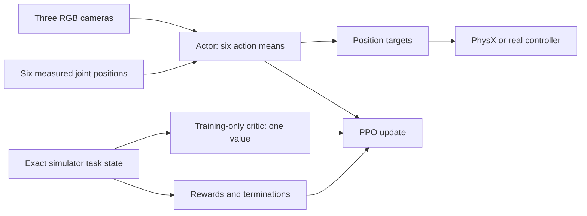

# SO-101 visual reinforcement-learning methodology

This document describes the object-in-cup task, camera/joint observation
contract, reward and termination logic, neural networks, PPO configuration,
randomization, and extension process. For asset preparation, launch commands,
checkpoint progression, export, and real-robot safety gates, see
[`README.md`](README.md).

## Supported design

The repository supports single-agent RSL-RL PPO for two three-camera tasks:

| Task | Role |
|---|---|
| `SO101-Object-In-Cup-Vision-Fixed-v0` | Nominal task used to prove visual learnability |
| `SO101-Object-In-Cup-Vision-v0` | Randomized task used for robustness and deployment |

The actor receives three RGB images and six measured joint positions and
outputs six normalized joint-position deltas. A separate training-only critic
receives one exact 34-value simulator task-state vector and outputs a scalar
value estimate. Only the actor is exported.

This is asymmetric PPO: simulator information can make the value estimate and
advantages more accurate without changing the deployable policy interface.
Simulator geometry, motion, and contact information also drives rewards,
success/failure, resets, and physics.

RSL-RL PPO is the only configured algorithm. The repository does not currently
provide SAC, TD3, behavior cloning, offline RL, recurrent policies, multi-agent
training, or interchangeable configurations for other Isaac Lab RL backends.

## Training methodology

The workflow isolates geometry and control errors before asking PPO to solve the
randomized task:

1. **Validate assets and control visibly.** Confirm that the cup is open, the
   cube fits, contacts are stable, camera views are correct, and normalized
   actions move the intended joints.
2. **Overfit the fixed visual task.** Use deterministic resets, nominal cameras,
   nominal appearance/physics, and no observation/action latency. This tests
   whether the visual inputs and reward allow the task to learn.
3. **Accept the fixed checkpoint.** Require at least 95% success and inspect
   grasp, transport, insertion, release, and settling behavior.
4. **Resume with randomization.** Load the accepted fixed checkpoint into the
   randomized task instead of relearning nominal behavior under every variation.
5. **Evaluate held-out episodes.** Require at least 90% success over 1,000
   randomized episodes whose seeds/conditions were not used to select the
   checkpoint.
6. **Verify export parity and real inputs.** Match checkpoint, TorchScript, and
   ONNX actions, then validate recorded real camera/joint streams in shadow mode
   before enabling command publication.

Removing the simulator-observation policy also removes a cheap non-visual
diagnostic. Visible fixed-task inspection and per-reward metrics are therefore
the supported ways to separate physics/reward failures from representation
learning failures.

## Environment and control loop

Physics runs at 100 Hz (`sim.dt = 0.01 s`). Environment decimation is five, so
actions, observations, rewards, terminations, and camera refresh run at 20 Hz
(`0.05 s`). A 15-second episode contains at most 300 policy steps.

Canonical joint/action order:

```text
shoulder_pan, shoulder_lift, elbow_flex, wrist_flex, wrist_roll, gripper
```

For policy output `a_t` clipped to `[-1, 1]`:

```text
arm target       = measured arm position + 0.05 * a_t
gripper target   = measured gripper position + 0.15 * a_t
```

This is a joint-position-delta controller, not torque control. Isaac Sim applies
the simulated articulation limits. The ROS adapter independently clips absolute
targets to the URDF limits with its safety margin.

The randomized task samples zero or one policy step of action latency. The fixed
task applies actions immediately.

## Actor and critic observations

The actor uses the deployable observation groups:

```text
joint_state  [N, 6]            absolute joint positions in radians
wrist       [N, 3, 120, 160]  RGB / 255 - 0.5
overhead_1  [N, 3, 120, 160]  RGB / 255 - 0.5
overhead_2  [N, 3, 120, 160]  RGB / 255 - 0.5
```

It does not receive joint velocity, previous action, object/cup pose, object
velocity, reward phase, termination counters, or success flags. The randomized
task adds small joint measurement noise and image corruption/latency; the fixed
task disables both.

The critic uses one concatenated, noiseless `critic_state` group:

| Component | Width | Meaning |
|---|---:|---|
| Absolute joint positions | 6 | Canonical SO-101 joint order, including gripper |
| Joint velocities | 6 | Exact simulated joint rates |
| Last requested action | 6 | Previous normalized policy command |
| Gripper-to-object delta | 3 | Object position minus grasp-frame position |
| Object-to-cup delta | 3 | Object position minus cup position |
| Object quaternion | 4 | Exact simulated object orientation |
| Object linear velocity | 3 | World-frame linear velocity |
| Object angular velocity | 3 | World-frame angular velocity |
| **Total** | **34** | |

The gripper joint is already present in the six joint positions, so the old
standalone gripper value is not duplicated. The critic also excludes cameras,
observation noise, delay-buffer internals, and randomized dynamics parameters.
It is task-complete rather than a dump of every simulator field.



Changing actor observations is a deployment interface change and requires
matching export-manifest and ROS preprocessing changes. Changing only the
critic state invalidates checkpoints but does not change deployment.

## Reward design

The reward is a dense task sequence plus two smoothness penalties. Let:

- `p_o`, `p_c`, and `p_e` be object, cup, and end-effector positions;
- `d_eo = ||p_o - p_e||`;
- `r_oc = ||(p_o - p_c)_xy||`;
- `z_oc = (p_o - p_c)_z`;
- `q_g` be gripper position, with larger values more open;
- `v_o` and `w_o` be object linear and angular velocity;
- `a_t` be the normalized action.

The generated asset manifest supplies placement geometry. For the current cube
and cup it is approximately:

```text
xy_tolerance = 0.003860 m
center_z_min = 0.014498 m
center_z_max = 0.038500 m
```

Rebuilding different assets can change these values.

### Configured terms

| Term | Raw value | Weight | Purpose |
|---|---|---:|---|
| Reach | `1 - tanh(d_eo / 0.06)` | `+1.0` | Move the grasp frame to the object |
| Grasp | `1[d_eo <= 0.035 and q_g <= 0.45]` | `+0.5` | Close near the object |
| Lift | `clip((p_o.z - p_c.z) / 0.075, 0, 1)` | `+2.0` | Raise the object |
| Transport | `(1 - tanh(r_oc / 0.08)) * 1[z_oc >= 0.045]` | `+3.0` | Align above the cup |
| Insertion | vertical progress times `1[r_oc <= xy_tolerance]` | `+5.0` | Lower an aligned object |
| Release | `1[inside cup and q_g >= 1.20]` | `+8.0` | Open after insertion |
| Stable | `1[released, inside, and slow]` | `+20.0` | Complete a settled placement |
| Action rate | `||a_t - a_(t-1)||^2` | `-0.02` | Discourage abrupt commands |
| Joint velocity | `||joint_velocity||^2` | `-0.0005` | Discourage unnecessary speed |

Insertion progress is:

```text
clip((0.090 - z_oc) / (0.090 - center_z_max), 0, 1)
```

The stable-placement mask requires:

```text
r_oc <= xy_tolerance
center_z_min <= z_oc <= center_z_max
||v_o|| <= 0.025 m/s
||w_o|| <= 0.50 rad/s
q_g >= 1.20 rad
```

Isaac Lab treats reward weights as rates. At the 20 Hz policy frequency:

```text
reward_t = 0.05 * sum(weight_i * raw_term_i)
```

The dense terms are active every step; there is no hidden phase or scripted
state machine. Height gates transport, alignment gates insertion, and the larger
release/stability terms keep completion more valuable than hovering.

### Reward limitations

- Grasp uses proximity and gripper closure rather than verified finger contact.
- Lift rewards object height regardless of the cause of motion.
- Transport can reward hovering when release/stability are too difficult.
- The geometry-derived insertion tolerance is narrow; inspect trajectories
  before widening what counts as insertion.
- Excessive smoothness penalties can suppress motion needed within 15 seconds.

Inspect `Episode_Reward/<term>` metrics and trajectories. Increasing total
reward alone does not prove the intended behavior.

## Success and termination

| Condition | Definition |
|---|---|
| Success | Stable-placement mask remains true for 10 consecutive policy steps |
| Dropped | Object world height falls below `-0.02 m` |
| Invalid | Object or robot joint state contains NaN/Inf |
| Timeout | 15 seconds or 300 policy steps |

Ten steps at 20 Hz is a 0.5-second settling window. The counter resets whenever
the mask becomes false, so a transient pass through the cup is not success.
Timeout is a truncation, allowing PPO to bootstrap the value estimate.

## Fixed task and domain randomization

The fixed task disables reset variation, material/actuator randomization,
camera perturbation, image corruption, joint noise, and camera/action latency.
It answers one question: can the nominal visual task learn?

The randomized task includes:

- object/cup XY reset offsets and object yaw;
- object mass and object/cup contact material;
- actuator stiffness/damping and joint reset/observation noise;
- camera position, rotation, and FOV;
- object, cup, table, and lighting appearance;
- exposure, contrast, RGB gain, and Gaussian image noise;
- zero/one-step camera and action latency.

Layout variation grows linearly over 30,000,000 environment steps. Object XY
half-range grows from 4 mm to 25 mm, cup XY half-range from 3 mm to 20 mm, and
object yaw grows to `[-pi, pi]`. Startup physics samples are chosen when the
environment process is created; reset events are sampled per episode.

Randomization ranges are transfer hypotheses, not evidence. Measure real camera
calibration, timing, friction, and actuator response, then revise ranges from
data. Ranges that are too narrow cause brittleness; ranges that are too broad
can prevent early learning.

## Neural-network architecture

The actor owns three independent camera encoders whose weights are not shared
between views. The critic is a separate normalized MLP over its 34-value state.
Training therefore uses three CNN encoders rather than six.

For each `[3, 120, 160]` image:

```text
Conv2d(3 -> 16, kernel=8, stride=4)   + ELU
Conv2d(16 -> 32, kernel=4, stride=2)  + ELU
Conv2d(32 -> 32, kernel=3, stride=1)  + ELU
SpatialSoftmax(32 feature maps)       -> 64 XY values
```

Without padding, the final feature map is `[32, 11, 16]`. Spatial softmax
converts each feature channel to an expected normalized `(x, y)` coordinate.
Three views contribute 192 values; six normalized joint positions produce a
198-value fused latent.

The actor head uses ELU widths `[512, 256, 128]` and outputs the mean of a
six-dimensional Gaussian initialized with standard deviation `0.7`. The critic
MLP uses ELU widths `[256, 256, 128]` and produces one deterministic value. The
exported actor uses the Gaussian mean rather than a sampled action.

Compared with a camera critic, exact task state normally gives PPO a more
accurate value baseline and lower-variance advantages while reducing VRAM and
compute. It can improve sample efficiency, but it does not guarantee that the
visual actor will learn. Real inference is unchanged because the critic is not
exported.

Spatial softmax emphasizes feature location, which suits object-in-cup control,
but learned features are not guaranteed to correspond to the cube, cup, or
gripper. Inspect renders and learned keypoints when diagnosing failures.

Implementation and deployment adapters live in
[`models.py`](source/so101_rl/so101_rl/tasks/object_in_cup/agents/models.py).

## PPO configuration

PPO collects on-policy rollouts, estimates advantages with generalized
advantage estimation (GAE), and performs clipped minibatch updates.

| Parameter | Value |
|---|---:|
| Rollout length | 32 steps/environment |
| Learning epochs/rollout | 5 |
| Minibatches/epoch | 8 |
| Learning rate | `7e-5`, fixed |
| Discount `gamma` | `0.99` |
| GAE `lambda` | `0.95` |
| PPO clip | `0.2` |
| Value-loss coefficient | `1.0` |
| Entropy coefficient | `0.005` |
| Initial action standard deviation | `0.7` |
| Maximum gradient norm | `1.0` |
| Checkpoint interval | 250 iterations |
| Maximum iterations | 15,000 |

With 64 environments, one process collects `64 * 32 = 2,048` transitions per
iteration. This environment count is only a starting point; rendering the three
actor views usually determines capacity, while the critic adds a small MLP.

Two-GPU training launches one process per physical GPU. Each process owns a
complete actor, critic, optimizer, and local simulation batch. RSL-RL
broadcasts initial parameters and averages gradients after PPO minibatches; the
models are replicated, not split.

The local source-built Isaac Sim path initializes its persistent NCCL group
before Kit creates the CUDA interop context. `TensorBroadcastPPO` replaces only
RSL-RL's initial CUDA object broadcast with tensor broadcasts. Rollouts, losses,
optimization, and gradient averaging remain standard RSL-RL PPO.

## Algorithm boundary

RSL-RL PPO is ready to run and owns the supported checkpoint/export path. An
`--rl_library` value is not an algorithm switch: another backend needs its own
registration, agent configuration, multi-input model, observation mapping,
checkpoint handling, and exporter.

Reasonable future extensions include:

| Approach | Required work |
|---|---|
| Different PPO CNN/MLP heads | Add a named RSL-RL model configuration and preserve input/export contracts |
| Recurrent PPO | Add hidden-state reset, checkpoint/export state I/O, manifest fields, and ROS state handling |
| Behavior-cloning pretraining | Preprocess demonstrations with exactly the same camera/joint/action contract, then fine-tune PPO |
| Another Isaac Lab backend | Implement its camera model, observation mapping, runner registration, and matching exporter |

SAC and TD3 are not drop-in replacements. They require an off-policy backend,
replay storage, a multi-input visual model, and new export/parity handling;
pixel replay also has substantial memory cost. AMP requires reference-motion
data, while IPPO/MAPPO target multi-agent formulations, so those advertised
backend choices do not fit this task without redesign.

## Extension guide

### Tune the existing networks

Create a new named runner preset rather than silently changing an accepted
baseline:

1. Copy the relevant actor or critic configuration in
   [`rsl_rl_vision_ppo_cfg.py`](source/so101_rl/so101_rl/tasks/object_in_cup/agents/rsl_rl_vision_ppo_cfg.py).
2. Change actor CNN channels/kernels/strides, spatial-softmax temperature, actor
   head widths, critic MLP widths, activation, normalization, or distribution
   settings.
3. For actor changes, confirm every convolution produces positive dimensions. Spatial
   softmax requires `global_pool="none"` and an unflattened feature map.
4. Give incompatible experiments distinct `experiment_name` values.
5. Validate the 34-value critic contract, scalar value output, actor forward
   shape, and actor export before training.
6. Compare short fixed-task runs with identical seeds, rollout budgets, and
   evaluation episodes.

Changing only configuration values requires no new model class. Changing camera
fusion, sharing, recurrence, or export signatures does.

### Create a custom RSL-RL model

Use `SpatialSoftmaxCNNModel` as the concrete deployable-actor example. A
replacement actor should:

1. Accept RSL-RL's observation `TensorDict`, group mapping, actor set name, and
   action output width.
2. Validate every image and one-dimensional input shape at construction.
3. Keep `get_latent()` and `_get_latent_dim()` consistent.
4. Implement actual hidden-state reset if `is_recurrent` is true.
5. Provide `as_jit()` and `as_onnx()` adapters whose deployment
   signature is unchanged.
6. Register the class with a fully qualified config name, for example:

   ```python
   @configclass
   class MyVisualModelCfg(RslRlCNNModelCfg):
       class_name = "so101_rl.tasks.object_in_cup.agents.my_model:MyVisualModel"
   ```

7. Update export, manifest, and ROS preprocessing whenever actor I/O changes.

The critic uses the standard RSL-RL MLP model. If its task-state layout changes,
update the documented component order, width constant, contract test, and
checkpoint compatibility note together.

### Create a reward or termination

For a reward:

1. Add a vectorized function to
   [`mdp/rewards.py`](source/so101_rl/so101_rl/tasks/object_in_cup/mdp/rewards.py).
2. Export it explicitly from `mdp/__init__.py`.
3. Add a visible `RewardTermCfg` with its parameters and weight.
4. Put reusable pure tensor geometry in `mdp/geometry.py`.
5. Test meaningful boundaries or stateful behavior and inspect per-term metrics.

Minimal pattern:

```python
def my_reward(env, scale: float) -> torch.Tensor:
    error = ...  # [num_envs]
    return torch.exp(-scale * error)

my_term = RewTerm(func=mdp.my_reward, weight=1.0, params={"scale": 10.0})
```

A raw term near `1.0` with weight `1.0` contributes about `0.05` per policy step
at the current frequency.

A stateless termination returns one boolean per environment. Stateful logic
such as the settling window should subclass `ManagerTermBase`, allocate tensors
on `env.device`, and reset only requested environment IDs. Define success from
physical predicates rather than a tunable reward threshold.

### Create an observation or action

For an observation:

1. Implement a vectorized manager term in `mdp/`.
2. Add it to a named observation group.
3. Decide explicitly whether it belongs to the deployable actor or the
   training-only critic.
4. For actor inputs, confirm real measurability and update export, preprocessing,
   and manifest contracts.
5. For critic inputs, update the fixed component layout, width, and checkpoint
   compatibility documentation.

For an action:

1. Define position, delta-position, velocity, or torque semantics first.
2. Implement order, scaling, clipping, limits, and latency in Isaac Lab.
3. Implement exactly the same conversion in deployment.
4. Revalidate joint directions and limits visibly before training.

Changing action semantics invalidates checkpoints even if the tensor width is
still six.

### Create another visual task

Keep related tasks inside this external package rather than modifying the Isaac
Lab checkout:

1. Create `source/so101_rl/so101_rl/tasks/<task_name>/` with environment, MDP,
   registration, and agent configuration modules.
2. Define the scene, sensors, action, camera/joint observations, rewards,
   terminations, events, physics rate, episode duration, and environment count.
3. Provide a fixed visual variant before the randomized variant.
4. Configure a camera-based actor, task-state MLP critic, and unique experiment
   name.
5. Register unique Gym IDs and import the task module from `tasks/__init__.py`.
6. Add visible zero/random-action checks, focused contract/boundary tests,
   held-out evaluation, and export/deployment checks.
7. Document the ordered workflow and limitations.

Do not add simulator-only values to the deployable actor. Keep them in the
training-only critic or task scoring/reset paths, with an explicit documented
contract.

## Source map

| Concern | Source |
|---|---|
| Robot, scene, physics, rewards, terminations, reset events | [`object_in_cup_env_cfg.py`](source/so101_rl/so101_rl/tasks/object_in_cup/object_in_cup_env_cfg.py) |
| Cameras, model observations/actions, fixed/randomized variants | [`vision_env_cfg.py`](source/so101_rl/so101_rl/tasks/object_in_cup/vision_env_cfg.py) |
| Exact 34-value critic state | [`mdp/critic_observations.py`](source/so101_rl/so101_rl/tasks/object_in_cup/mdp/critic_observations.py) |
| Reward formulas | [`mdp/rewards.py`](source/so101_rl/so101_rl/tasks/object_in_cup/mdp/rewards.py) |
| Placement geometry | [`mdp/geometry.py`](source/so101_rl/so101_rl/tasks/object_in_cup/mdp/geometry.py) |
| Stateful success and failures | [`mdp/terminations.py`](source/so101_rl/so101_rl/tasks/object_in_cup/mdp/terminations.py) |
| Layout curriculum | [`mdp/events.py`](source/so101_rl/so101_rl/tasks/object_in_cup/mdp/events.py) |
| Image preprocessing/latency | [`mdp/vision_observations.py`](source/so101_rl/so101_rl/tasks/object_in_cup/mdp/vision_observations.py) |
| Action latency | [`mdp/vision_actions.py`](source/so101_rl/so101_rl/tasks/object_in_cup/mdp/vision_actions.py) |
| PPO/model configuration | [`agents/rsl_rl_vision_ppo_cfg.py`](source/so101_rl/so101_rl/tasks/object_in_cup/agents/rsl_rl_vision_ppo_cfg.py) |
| CNN models and exporters | [`agents/models.py`](source/so101_rl/so101_rl/tasks/object_in_cup/agents/models.py) |
| Gym registrations | [`object_in_cup/__init__.py`](source/so101_rl/so101_rl/tasks/object_in_cup/__init__.py) |

## Experimental record

For every run used to make a design decision, record:

- Git revision and uncommitted configuration changes;
- task ID, seed, environment/GPU counts, and checkpoint source;
- actor/critic architecture and observation groups;
- PPO parameters and rollout budget;
- asset-manifest and camera-calibration hashes;
- randomization ranges and curriculum progress;
- fixed and held-out success rates with episode counts;
- failure categories such as no grasp, drop, rim collision, no release,
  unstable placement, timeout, or invalid simulation;
- checkpoint/export parity results.

Without these records, higher return can reflect an easier reset distribution
or changed success geometry rather than a better visual policy.
