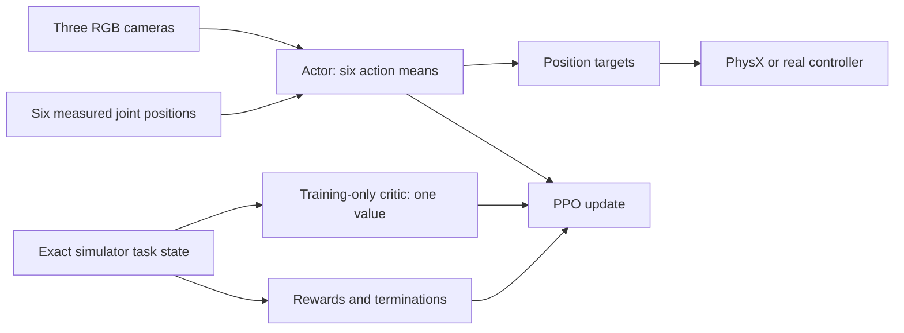

# SO-101 visual reinforcement-learning methodology

This document describes the shared SO-101 visual platform, its single- and
three-box scenarios, observation contracts, rewards, neural networks, PPO,
randomization, and extension process. For asset preparation, launch commands,
checkpoint progression, export, and real-robot safety gates, see
[`README.md`](README.md).

## Supported design

The repository supports single-agent RSL-RL PPO for four three-camera tasks:

| Task | Role |
|---|---|
| `SO101-Object-In-Cup-Vision-Fixed-v0` | Nominal task used to prove visual learnability |
| `SO101-Object-In-Cup-Vision-v0` | Randomized task used for robustness and deployment |
| `SO101-Three-Boxes-In-Cups-Vision-Fixed-v0` | Nominal three-placement task |
| `SO101-Three-Boxes-In-Cups-Vision-v0` | Curriculum-randomized three-placement task |

The actor receives three RGB images and six measured joint positions and
outputs six normalized joint-position deltas. A separate training-only critic
receives exact scenario state—34 values for one box or 84 for three—and outputs
a scalar value estimate. Only the actor is exported.

This is asymmetric PPO: simulator information can make the value estimate and
advantages more accurate without changing the deployable policy interface.
Simulator geometry, motion, and contact information also drives rewards,
success/failure, resets, and physics.

RSL-RL PPO is the only configured algorithm. The repository does not currently
provide SAC, TD3, behavior cloning, offline RL, recurrent policies, multi-agent
training, or interchangeable configurations for other Isaac Lab RL backends.

## Training methodology

The workflow isolates geometry and control errors before asking PPO to solve the
randomized task:

1. **Validate assets and control visibly.** Confirm that the cup is open, the
   cube fits, contacts are stable, camera views are correct, and normalized
   actions move the intended joints.
2. **Overfit the fixed visual task.** Use deterministic resets, nominal cameras,
   nominal appearance/physics, and no observation/action latency. This tests
   whether the visual inputs and reward allow the task to learn.
3. **Accept the fixed checkpoint.** Require at least 95% success and inspect
   grasp, transport, insertion, release, and settling behavior.
4. **Resume with randomization.** Load the accepted fixed checkpoint into the
   randomized task instead of relearning nominal behavior under every variation.
5. **Evaluate held-out episodes.** Require at least 90% success over 1,000
   randomized episodes whose seeds/conditions were not used to select the
   checkpoint.
6. **Verify export parity and real inputs.** Match checkpoint, TorchScript, and
   ONNX actions, then validate recorded real camera/joint streams in shadow mode
   before enabling command publication.

Removing the simulator-observation policy also removes a cheap non-visual
diagnostic. Visible fixed-task inspection and per-reward metrics are therefore
the supported ways to separate physics/reward failures from representation
learning failures.

## Environment and control loop

Physics runs at 120 Hz (`sim.dt = 1/120 s`). Environment decimation is four, so
actions, observations, rewards, terminations, and camera refresh run at 30 Hz
(`1/30 s`). The single-box horizon is 15 seconds or 450 steps; the three-box
horizon is 45 seconds or 1,350 steps.

Canonical joint/action order:

```text
shoulder_pan, shoulder_lift, elbow_flex, wrist_flex, wrist_roll, gripper
```

For policy output `a_t` clipped to `[-1, 1]`:

```text
arm target       = measured arm position + (1/30) * a_t
gripper target   = measured gripper position + 0.10 * a_t
```

This is a joint-position-delta controller, not torque control. Isaac Sim applies
the simulated articulation limits. The ROS adapter independently clips absolute
targets to the URDF limits with its safety margin.

Each randomized task samples zero or one policy step of action latency. Fixed
variants apply actions immediately.

## Actor and critic observations

The actor uses the deployable observation groups:

```text
joint_state  [N, 6]            absolute joint positions in radians
wrist       [N, 3, 120, 160]  RGB / 255 - 0.5
overhead_1  [N, 3, 120, 160]  RGB / 255 - 0.5
overhead_2  [N, 3, 120, 160]  RGB / 255 - 0.5
```

It does not receive joint velocity, previous action, object/cup pose, object
velocity, reward phase, termination counters, or success flags. The randomized
task adds small joint measurement noise and image corruption/latency; the fixed
task disables both.

The single-box critic uses one concatenated, noiseless `critic_state` group:

| Component | Width | Meaning |
|---|---:|---|
| Absolute joint positions | 6 | Canonical SO-101 joint order, including gripper |
| Joint velocities | 6 | Exact simulated joint rates |
| Last requested action | 6 | Previous normalized policy command |
| Gripper-to-object delta | 3 | Object position minus grasp-frame position |
| Object-to-cup delta | 3 | Object position minus cup position |
| Object quaternion | 4 | Exact simulated object orientation |
| Object linear velocity | 3 | World-frame linear velocity |
| Object angular velocity | 3 | World-frame angular velocity |
| **Total** | **34** | |

The gripper joint is already present in the six joint positions, so the old
standalone gripper value is not duplicated. The critic also excludes cameras,
observation noise, delay-buffer internals, and randomized dynamics parameters.
It is task-complete rather than a dump of every simulator field.

The three-box task uses a separate 84-value contract:

| Component | Width | Ordering |
|---|---:|---|
| Absolute joint positions | 6 | Canonical SO-101 order |
| Joint velocities | 6 | Canonical SO-101 order |
| Last requested action | 6 | Canonical SO-101 order |
| Gripper-to-box deltas | 9 | Box 1 through box 3 |
| All box-to-cup deltas | 27 | Box-major, then cup 1 through cup 3 |
| Box quaternions | 12 | Box 1 through box 3 |
| Box linear velocities | 9 | Box 1 through box 3 |
| Box angular velocities | 9 | Box 1 through box 3 |
| **Total** | **84** | |

It contains no occupancy flags or chosen assignment. Those are derived by the
reward and termination logic, leaving the critic state exact and unambiguous.



Changing actor observations is a deployment interface change and requires
matching export-manifest and ROS preprocessing changes. Changing only the
critic state invalidates checkpoints but does not change deployment.

## Single-box reward design

The single-box reward is deliberately **grasp-agnostic**: every term is
computed from object, cup, and gripper state only. There are no contact
sensors and no prescribed grasp geometry, so the policy is free to find any
method (pinch, scoop, push-against-wall) and no term can be farmed without
achieving its outcome. One shaping term (`approach`) opens the ladder;
everything after it pays for outcomes. Let:

- `p_o`, `p_c`, and `p_g` be object position, cup position, and the nominal
  grasp point (the `ee_frame` `grasp_frame` offset
  `(0.0052, -0.000218, -0.0925)` m in `gripper_link`, i.e. where the centre of
  a 25 mm cube sits against the fixed pad);
- `d_og = ||p_o - p_g||`;
- `r_oc = ||(p_o - p_c)_xy||`;
- `z_oc = (p_o - p_c)_z`;
- `q_g` be gripper position, with larger values more open;
- `z_rest = 0.0125` m, the object-centre height while resting on the table;
- `v_o` and `w_o` be object linear and angular velocity;
- `a_t` be the normalized action.

The generated asset manifest supplies placement geometry. For the current cube
and cup it is approximately:

```text
xy_tolerance = 0.003860 m
center_z_min = 0.014498 m
center_z_max = 0.038500 m
```

Rebuilding different assets can change these values.

### Configured terms

| Term | Raw value | Weight | Purpose |
|---|---|---:|---|
| Approach progress | new episode-best of `(1 - tanh(d_og / 0.08))` | `+1.0` | Bring the gripper's grasp region to the cube; jaw geometry does not enter |
| Lift progress | `clip((p_o.z - z_rest) / 0.05, 0, 1)` each step (dense) | `+1.0` | The cube is picked up, however achieved |
| Transport | `(1 - tanh(r_oc / 0.08)) * 1[z_oc >= z_rest + 0.001] * decay(n_aloft)` | `+3.0` | Move the object toward the cup; full credit for ~0.5 s after lift then decaying to 0.2 over ~2 s so hovering cannot be farmed |
| Insertion | vertical progress times `1[r_oc <= xy_tolerance]` | `+5.0` | Lower an aligned object |
| Release | `1[inside cup and q_g >= 1.20]` | `+8.0` | Open after insertion |
| Stable | `1[released, inside, and slow]` | `+20.0` | Complete a settled placement |
| Action rate | `||a_t - a_(t-1)||^2` | `-0.005` | Discourage abrupt commands |
| Joint velocity | `||joint_velocity||^2` | `-0.0005` | Discourage unnecessary speed |

### Outcome ladder (approach → lift → transport)

The pickup half of the ladder is outcome-based rather than contact-based:

1. **Approach** (weight `+1.0`) — the only shaping term. It scores
   `1 - tanh(d_og / 0.08)` between the cube centre and the nominal grasp
   point and pays only the improvement over the episode's best score
   (total budget `1`). Hovering at the cube or backing off and re-approaching
   cannot farm it, and it prescribes nothing about approach direction,
   orientation, or grasp strategy — it bridges the gap between flailing in
   the void and the first lucky grasp that lift can reward.

2. **Lift** (weight `+1.0`, dense) — a smooth ramp on the cube's height above
   its resting height, saturating 5 cm above rest (`height_scale = 0.05`).
   Any method that raises the cube earns it: the first upward nudge pays a
   sliver, a genuine hold pays the full amount. It cannot be farmed because
   earning it requires the cube to actually be up. It is *not* gated on
   contact: a scoop or squeeze that lifts the cube earns it identically to a
   textbook pinch.

3. **Transport** (weight `+3.0`, dense) — `(1 - tanh(r_oc / 0.08))` supplies
   the directional signal toward the cup, conditioned on lift height: a linear
   ramp from 0 at `z_rest + 0.001` m to 1 at `lift_height` (0.03 m) above that
   gate scales the term, so pushing the cube along the table earns nothing and
   partial credit accrues only with height actually gained. The conditioned
   term is further multiplied by a per-env decay schedule `decay(n)` over the
   number of consecutive steps the cube has been continuously above the
   clearance: `1.0` for the first `grace_steps` (30) steps, then a linear ramp
   to `decay_floor` (0.2) over the next `decay_steps` (120) steps. The counter
   resets to zero the moment the cube drops below clearance, so a fresh
   transport after a genuine drop re-arms the full reward. This prevents the
   policy from settling into a stable hover-and-farm policy where the dense
   transport term dominates the sparse insertion/release/stability rewards.

Insertion progress is:

```text
clip((0.090 - z_oc) / (0.090 - center_z_max), 0, 1)
```

The stable-placement mask requires:

```text
r_oc <= xy_tolerance
center_z_min <= z_oc <= center_z_max
||v_o|| <= 0.025 m/s
||w_o|| <= 0.50 rad/s
q_g >= 1.20 rad
```

Isaac Lab treats reward weights as rates. Approach divides its positive
progress by `env.step_dt`, cancelling the manager's later time-step
multiplication; it retains an episode budget of `1`. Lift and Transport are
dense (rate form). Lift pays at most `1.0 * 1.0 / 30 = 0.0333` per step at
full height, so a full 15-second episode of uninterrupted full-height holding
contributes at most `15.0`. At 30 Hz:

```text
reward_t = (1/30) * sum(weight_i * raw_term_i)
```

Transport is stateful: it carries a per-env consecutive-steps-aloft counter so
its decay schedule can be applied; the counter resets on env reset and
whenever the cube drops below clearance. Insertion, release, stable placement,
action rate, and joint velocity are dense or penalty terms outside the pickup
ladder.

### Reward limitations

Single box:

- Transport decays to `decay_floor` (0.2) within ~2.5 s of sustained aloft
  holding so it can no longer be farmed by hovering; a policy that genuinely
  needs longer to reposition may see reduced transport credit late in a long
  carry, but insertion/release/stability pay far more once reached.
- The geometry-derived insertion tolerance is narrow; inspect trajectories
  before widening what counts as insertion.
- Excessive smoothness penalties can suppress motion needed within 15 seconds.
- Because lift and approach prescribe no grasp method, the shaped ladder alone
  cannot distinguish a robust pinch from a marginal scoop; inspect held-out
  trajectories and release behaviour before export.

Three boxes (in addition to the above, where they apply):

- The pads are a thin simulator-only approximation of the inner jaw surfaces;
  they validate a bilateral pinch but do not model tactile pressure fields.
- Closure can be farmed by repeatedly reopening and reclosing around a box;
  its `+0.1` weight keeps a full extra close well below a real grasp.
- Grasp held is geometry-based with no height scaling: clamping an unplaced
  box between the pads with the gripper closed earns it even on the table. The
  closed-gripper gate (`q_g <= 0.15` rad, versus the ~`0.10` rad the cube
  physically permits) keeps it focused on an actual squeeze, and Lift requires
  bilateral contact plus off-table height, so a table-clamp alone earns no
  Lift.
- Dense Lift can reward holding just above the table without transporting,
  but its `+0.2` weight is intentionally small and Transport supplies the
  directional signal toward an empty cup.

Inspect `Episode_Reward/<term>` metrics and trajectories. Increasing total
reward alone does not prove the intended behavior.

## Single-box success and termination

| Condition | Definition |
|---|---|
| Success | Stable-placement mask remains true for 15 consecutive policy steps |
| Dropped | Object world height falls below `-0.02 m` |
| Invalid | Object or robot joint state contains NaN/Inf |
| Timeout | 15 seconds or 450 policy steps |

Fifteen steps at 30 Hz is a 0.5-second settling window. The counter resets whenever
the mask becomes false, so a transient pass through the cup is not success.
Timeout is a truncation, allowing PPO to bootstrap the value estimate.

## Three-box scenario

The boxes and cups are interchangeable. For every reward and success check, the
task evaluates all six possible one-to-one assignments and selects the
highest-scoring assignment. Consequently, a box may enter any cup, but two
boxes in the same cup can never satisfy all-three success.

Approach tracks bounded best alignment independently for every unplaced box;
closure credits the best-aligned unplaced box at each step. Their buffers
remain per box. Grasp and lift use the sensor filter
for each box, so contacts on two different boxes cannot combine. The existing
permutation-invariant placement mask excludes already placed boxes from all
four pickup terms. Each sequential pickup therefore receives its own bounded
approach budget (`1`) plus one grasp-acquired impulse per grasp attempt, with
dense closure, grasp-held, and lift credits in between. Transport considers
only unplaced boxes and empty cups.
Insertion, release, and stable-placement progress sum the best assignment and
divide by three so their maximum raw values remain `1.0`.

### Contact pads and grasp targets

The simulation robot has invisible collision-only bodies on the two inner jaw
faces. Each is a 0.5 mm-thick, 18 x 25 mm pad with 0.1 g mass and a face 0.1 mm
proud of the original mesh. Fixed-joint merging is disabled during URDF import,
so the pads remain separate rigid bodies without adding controllable joints.
The ordinary ROS Xacro leaves them out unless
`simulation_contact_pads:=true` is explicitly selected.

One PhysX contact sensor addresses each pad, filtered to the three boxes. Both
retain four 120 Hz force samples. A valid grasp requires force greater than
0.1 N from both pads against the same box in the same stored physics substep.
Unilateral, asynchronous, exterior-jaw, and different-box contacts are not
valid grasps.

The pickup terms do not use the fixed single-box grasp-frame offset; the grasp
target follows box orientation. If `n` is the fixed pad's world-space inward
normal and `h` is the box half-extent vector, the attainable box centre is:

```text
support(n) = sum(abs(R_box^T n) * h)
p_t = p_pad_center + n * (pad_thickness / 2 + support(n) + 0.0005)
```

This moves a 45-degree box farther into the open gap by its projected support
distance while keeping the other two coordinates aligned with the pad centre.

### Configured terms (three boxes)

| Term | Raw value | Weight | Purpose |
|---|---|---:|---|
| Approach progress | new episode-best of `(1 - tanh(d_ot / 0.04))` per unplaced box | `+1.0` | Bring the fixed pad to the grasp target (jaw position does not enter) |
| Closure progress | `max(q_prev - q_g, 0) / 1.2` times geometric alignment to the fourth power once the box edge is 1 mm inside the jaw tips | `+0.1` | Close around the box on every pickup attempt |
| Grasp acquired | one impulse per grasp attempt on rising-edge bilateral contact (re-arms when contact drops) | `+1.0` | Confirm a physical same-box pinch and reward retries |
| Grasp held | count of unplaced boxes between the pads with `q_g <= 0.15` each step (dense) | `+0.5` | Continuous hold signal bridging closure and lift |
| Lift progress | count of unplaced boxes with `p_o.z >= z_rest + 0.001` and bilateral contact (dense) | `+0.2` | Hold pinched boxes off the table, independent of height |
| Transport | best `(1 - tanh(r_oc / 0.08))` over unplaced-box/empty-cup pairs, gated on lift clearance | `+3.0` | Move each box toward some empty cup |
| Insertion | best-assignment vertical progress times alignment, divided by three | `+5.0` | Lower aligned boxes |
| Release | best-assignment placed-and-released mask, divided by three | `+8.0` | Open after insertion |
| Stable | best-assignment released-inside-slow mask, divided by three | `+20.0` | Complete settled placements |
| Action rate | `||a_t - a_(t-1)||^2` | `-0.02` | Discourage abrupt commands |
| Joint velocity | `||joint_velocity||^2` | `-0.0005` | Discourage unnecessary speed |

### Pickup reward chain (approach → closure → grasp → lift)

The five pickup terms form a gated cascade; each stage unlocks the next:

1. **Approach** (weight `+1.0`) — episode-best alignment `1 - tanh(d_ot / 0.04)`
   between each unplaced box and its orientation-aware grasp target. Pays only
   new improvement, total budget `1` per box. Jaw position does not enter, so
   approach never rewards being open and does not compete with closing.

2. **Closure** (weight `+0.1`) — closing motion
   `max(q_prev - q_g, 0) / 1.2` multiplied by `alignment^4` of the
   best-aligned unplaced box, gated on that box lying between the fixed and
   moving pads with its leading edge at least 1 mm past the fixed-pad tip.
   Box orientation is included when locating that edge. Reopening pays zero,
   while a later aligned close can pay again after a failed grip.

3. **Grasp acquired** (weight `+1.0`) — one impulse per box the first substep
   both pads exceed `0.1 N` against that same box (bilateral contact). It is
   retryable: the impulse re-arms the step bilateral contact is lost, so each
   fresh pinch after a drop earns it again. Within one continuous contact
   session it still fires at most once (rising edge), so holding cannot farm
   it.

4. **Grasp held** (weight `+0.5`, dense) — pays every step for each unplaced
   box between the pads with the gripper at or below `q_g = 0.15` rad. It is
   based on grasp *geometry*, not contact force, so it gives a continuous hold
   signal while the box is clamped even when bilateral contact is marginal.
   The `0.15` rad threshold corresponds to a jaw gap only slightly wider than
   the 25 mm box (the box physically stops the gripper near `0.10` rad), so
   the term means "actually squeezing" rather than merely "closing near the
   box." It has no height scaling — clamping a box on the table earns it the
   same as holding it aloft; see the limitations above.

5. **Lift** (weight `+0.2`, dense) — pays a constant `1` per box each step
   when its centre is at least 1 mm above rest **and** bilateral contact
   holds. The reward is the same whether the box is 1 mm or 100 mm above its
   resting height, so it encourages maintaining an off-table grip without
   driving the arm overhead. Dropping or lowering the box below the clearance
   makes the term zero.

Alignment and the between-pads geometry gate Closure; the between-pads geometry
plus the closed-gripper gate drive Grasp held; bilateral contact gates Grasp
acquired and Lift. Approach remains non-farmable through its episode-best
score. Closure is retryable so a failed grip does not remove its gradient, and
its `+0.1` weight keeps a complete extra close well below the value of the
physical grasp. Grasp acquired is retryable per attempt but bounded to one
impulse per contact session, so sustained holding earns the dense Grasp-held
and Lift rewards instead of farming the landmark. Unlike the single-box
transport, the three-box transport has no decay schedule: it selects the best
unplaced-box/empty-cup pair, and matched pairs drop out of both sides, so
hovering with the last box can farm at most `(1 - tanh(r/0.08)) * 3 / 30` per
step until insertion/release/stable pay far more.

A placed box is considered released when the gripper is open (`q_g >= 1.20`)
or the grasp frame has moved at least 50 mm away. The distance alternative is
necessary for a sequential task: closing the gripper around the next box must
not invalidate earlier placements. Success requires all three boxes to be slow and inside
three distinct cups for fifteen consecutive steps. Any dropped box terminates the
episode, and the horizon is 45 seconds.

The fixed layout uses three deterministic pickup anchors and three placement
anchors. The randomized variant expands over 45,000,000 environment steps into
separate reachable zones:

```text
boxes: x=[0.14, 0.30], y=[-0.13, -0.04]
cups:  x=[0.14, 0.30], y=[ 0.04,  0.13]
```

Reset rejection sampling maintains at least 40 mm between boxes, 60 mm between
cups, and 55 mm across types. A layout failure after 128 attempts is an error;
the environment does not silently accept overlaps.

## Fixed task and domain randomization

The fixed task disables reset variation, material/actuator randomization,
camera perturbation, image corruption, joint noise, and camera/action latency.
It answers one question: can the nominal visual task learn?

The randomized variants include:

- object/cup XY reset offsets and object yaw;
- object mass and object/cup contact material;
- actuator stiffness/damping and joint reset/observation noise;
- camera position, rotation, and FOV;
- object, cup, table, and lighting appearance;
- exposure, contrast, RGB gain, and Gaussian image noise;
- zero/one-step camera and action latency.

Layout variation grows linearly over 45,000,000 environment steps. The
single-box ranges grow from small nominal offsets to 25 mm for the box and 20 mm
for the cup. The three-box task grows from ±3 mm around fixed anchors into the
zones above. Startup physics samples are chosen when the environment process is
created; reset events are sampled per episode.

Randomization ranges are transfer hypotheses, not evidence. Measure real camera
calibration, timing, friction, and actuator response, then revise ranges from
data. Ranges that are too narrow cause brittleness; ranges that are too broad
can prevent early learning.

## Neural-network architecture

The actor owns three independent camera encoders whose weights are not shared
between views. The critic is a separate normalized MLP over its scenario's
34- or 84-value state. Training therefore uses three CNN encoders rather than
six.

For each `[3, 120, 160]` image:

```text
Conv2d(3 -> 16, kernel=8, stride=4)   + ELU
Conv2d(16 -> 32, kernel=4, stride=2)  + ELU
Conv2d(32 -> 32, kernel=3, stride=1)  + ELU
SpatialSoftmax(32 feature maps)       -> 64 XY values
```

Without padding, the final feature map is `[32, 11, 16]`. Spatial softmax
converts each feature channel to an expected normalized `(x, y)` coordinate.
Three views contribute 192 values; six normalized joint positions produce a
198-value fused latent.

The actor head uses ELU widths `[512, 256, 128]` and outputs the mean of a
six-dimensional Gaussian initialized with standard deviation `0.7`. The critic
MLP uses ELU widths `[256, 256, 128]` and produces one deterministic value. The
exported actor uses the Gaussian mean rather than a sampled action.

Compared with a camera critic, exact task state normally gives PPO a more
accurate value baseline and lower-variance advantages while reducing VRAM and
compute. It can improve sample efficiency, but it does not guarantee that the
visual actor will learn. Real inference is unchanged because the critic is not
exported.

Spatial softmax emphasizes feature location, which suits object-in-cup control,
but learned features are not guaranteed to correspond to the cube, cup, or
gripper. Inspect renders and learned keypoints when diagnosing failures.

Implementation and deployment adapters live in the shared
[`models.py`](source/so101_rl/so101_rl/tasks/common/agents/models.py).

## PPO configuration

PPO collects on-policy rollouts, estimates advantages with generalized
advantage estimation (GAE), and performs clipped minibatch updates.

| Parameter | Value |
|---|---:|
| Rollout length | 48 steps/environment |
| Learning epochs/rollout | 5 |
| Minibatches/epoch | 8 |
| Learning rate | `7e-5`, fixed |
| Discount `gamma` | `0.9933` |
| GAE `lambda` | `0.9664` |
| PPO clip | `0.2` |
| Value-loss coefficient | `1.0` |
| Entropy coefficient | `0.005` |
| Initial action standard deviation | `0.7` |
| Maximum gradient norm | `1.0` |
| Checkpoint interval | 250 iterations |
| Maximum iterations | 15,000 |

With 64 environments, one process collects `64 * 48 = 3,072` transitions per
iteration. This environment count is only a starting point; rendering the three
actor views usually determines capacity, while the critic adds a small MLP.

Two-GPU training launches one process per physical GPU. Each process owns a
complete actor, critic, optimizer, and local simulation batch. RSL-RL
broadcasts initial parameters and averages gradients after PPO minibatches; the
models are replicated, not split.

The local source-built Isaac Sim path initializes its persistent NCCL group
before Kit creates the CUDA interop context. `TensorBroadcastPPO` replaces only
RSL-RL's initial CUDA object broadcast with tensor broadcasts. Rollouts, losses,
optimization, and gradient averaging remain standard RSL-RL PPO.

## Algorithm boundary

RSL-RL PPO is ready to run and owns the supported checkpoint/export path. An
`--rl_library` value is not an algorithm switch: another backend needs its own
registration, agent configuration, multi-input model, observation mapping,
checkpoint handling, and exporter.

Reasonable future extensions include:

| Approach | Required work |
|---|---|
| Different PPO CNN/MLP heads | Add a named RSL-RL model configuration and preserve input/export contracts |
| Recurrent PPO | Add hidden-state reset, checkpoint/export state I/O, manifest fields, and ROS state handling |
| Behavior-cloning pretraining | Preprocess demonstrations with exactly the same camera/joint/action contract, then fine-tune PPO |
| Another Isaac Lab backend | Implement its camera model, observation mapping, runner registration, and matching exporter |

SAC and TD3 are not drop-in replacements. They require an off-policy backend,
replay storage, a multi-input visual model, and new export/parity handling;
pixel replay also has substantial memory cost. AMP requires reference-motion
data, while IPPO/MAPPO target multi-agent formulations, so those advertised
backend choices do not fit this task without redesign.

## Extension guide

### Tune the existing networks

Create a new named runner preset rather than silently changing an accepted
baseline:

1. Subclass the shared `SO101VisualPPOCfg` in the scenario's agent configuration.
2. Change actor CNN channels/kernels/strides, spatial-softmax temperature, actor
   head widths, critic MLP widths, activation, normalization, or distribution
   settings.
3. For actor changes, confirm every convolution produces positive dimensions. Spatial
   softmax requires `global_pool="none"` and an unflattened feature map.
4. Give incompatible experiments distinct `experiment_name` values.
5. Validate the scenario's critic width, scalar value output, actor forward
   shape, and actor export before training.
6. Compare short fixed-task runs with identical seeds, rollout budgets, and
   evaluation episodes.

Changing only configuration values requires no new model class. Changing camera
fusion, sharing, recurrence, or export signatures does.

### Create a custom RSL-RL model

Use `SpatialSoftmaxCNNModel` as the concrete deployable-actor example. A
replacement actor should:

1. Accept RSL-RL's observation `TensorDict`, group mapping, actor set name, and
   action output width.
2. Validate every image and one-dimensional input shape at construction.
3. Keep `get_latent()` and `_get_latent_dim()` consistent.
4. Implement actual hidden-state reset if `is_recurrent` is true.
5. Provide `as_jit()` and `as_onnx()` adapters whose deployment
   signature is unchanged.
6. Register the class with a fully qualified config name, for example:

   ```python
   @configclass
   class MyVisualModelCfg(RslRlCNNModelCfg):
       class_name = "so101_rl.tasks.common.agents.my_model:MyVisualModel"
   ```

7. Update export, manifest, and ROS preprocessing whenever actor I/O changes.

The critic uses the standard RSL-RL MLP model. If its task-state layout changes,
update the documented component order, width constant, contract test, and
checkpoint compatibility note together.

### Create a reward or termination

For a reward:

1. Add a vectorized function to the scenario's `mdp/rewards.py`.
2. Export it explicitly from `mdp/__init__.py`.
3. Add a visible `RewardTermCfg` with its parameters and weight.
4. Put reusable pure tensor geometry in `mdp/geometry.py`.
5. Test meaningful boundaries or stateful behavior and inspect per-term metrics.

Minimal pattern:

```python
def my_reward(env, scale: float) -> torch.Tensor:
    error = ...  # [num_envs]
    return torch.exp(-scale * error)

my_term = RewTerm(func=mdp.my_reward, weight=1.0, params={"scale": 10.0})
```

A raw term near `1.0` with weight `1.0` contributes about `0.0333` per policy step
at the current frequency.

A stateless termination returns one boolean per environment. Stateful logic
such as the settling window should subclass `ManagerTermBase`, allocate tensors
on `env.device`, and reset only requested environment IDs. Define success from
physical predicates rather than a tunable reward threshold.

### Create an observation or action

For an observation:

1. Implement a vectorized manager term in `mdp/`.
2. Add it to a named observation group.
3. Decide explicitly whether it belongs to the deployable actor or the
   training-only critic.
4. For actor inputs, confirm real measurability and update export, preprocessing,
   and manifest contracts.
5. For critic inputs, update the fixed component layout, width, and checkpoint
   compatibility documentation.

For an action:

1. Define position, delta-position, velocity, or torque semantics first.
2. Implement order, scaling, clipping, limits, and latency in Isaac Lab.
3. Implement exactly the same conversion in deployment.
4. Revalidate joint directions and limits visibly before training.

Changing action semantics invalidates checkpoints even if the tensor width is
still six.

### Create another visual task

The shared platform owns the robot, workcell, cameras, actor observation groups,
joint action, physics, common randomization, visual actor, and PPO defaults. A
new scenario should subclass those configs instead of copying them:

```python
@configclass
class MySceneCfg(SO101VisualSceneCfg):
    target: RigidObjectCfg = ...

@configclass
class MyObservationsCfg(SO101VisualObservationsCfg):
    critic_state: CriticStateCfg = CriticStateCfg()

@configclass
class MyEnvCfg(SO101VisualEnvCfg):
    scene = MySceneCfg(num_envs=64, env_spacing=0.8, replicate_physics=False)
    observations = MyObservationsCfg()
    rewards = MyRewardsCfg()
    terminations = MyTerminationsCfg()
    events = MyEventsCfg()
```

The scenario still owns meaningful semantics:

1. Add its assets to a scene subclass.
2. Add one documented, noiseless critic group to the shared actor observations.
3. Define vectorized reset, reward, termination, and pure geometry functions.
4. Provide a fixed subclass that calls `_apply_fixed_mode()` before disabling
   its own randomization.
5. Subclass `SO101VisualPPOCfg` only for a unique experiment name or intentional
   hyperparameter overrides.
6. Register unique fixed/randomized Gym IDs and import the scenario package.
7. Test task boundaries and run deployment-contract validation.

The three-box scenario is the concrete example: it reuses the platform without
adding actor inputs, while owning its six assets, collision-safe reset,
permutation matching, 84-value critic, rewards, and success definition.

Do not add simulator-only values to the deployable actor. Keep them in the
training-only critic or task scoring/reset paths, with an explicit documented
contract.

## Source map

| Concern | Source |
|---|---|
| Shared robot, workcell, cameras, actions, observations, physics, fixed mode | [`common/visual_env_cfg.py`](source/so101_rl/so101_rl/tasks/common/visual_env_cfg.py) |
| Shared actor, PPO, and distributed synchronization | [`common/agents/`](source/so101_rl/so101_rl/tasks/common/agents/) |
| Shared camera/action terms and visual randomization | [`common/mdp/`](source/so101_rl/so101_rl/tasks/common/mdp/) |
| Single-box scenario and 34-value critic | [`object_in_cup/`](source/so101_rl/so101_rl/tasks/object_in_cup/) |
| Three-box scenario and 84-value critic | [`three_boxes_in_cups/`](source/so101_rl/so101_rl/tasks/three_boxes_in_cups/) |
| Stable deployment constants | [`visual_contract.py`](source/so101_rl/so101_rl/visual_contract.py) |
| Contract-based export validation | [`export_manifest.py`](source/so101_rl/so101_rl/export_manifest.py) |

## Experimental record

For every run used to make a design decision, record:

- Git revision and uncommitted configuration changes;
- task ID, seed, environment/GPU counts, and checkpoint source;
- actor/critic architecture and observation groups;
- PPO parameters and rollout budget;
- asset-manifest and camera-calibration hashes;
- randomization ranges and curriculum progress;
- fixed and held-out success rates with episode counts;
- failure categories such as no grasp, drop, rim collision, no release,
  unstable placement, timeout, or invalid simulation;
- checkpoint/export parity results.

Without these records, higher return can reflect an easier reset distribution
or changed success geometry rather than a better visual policy.
