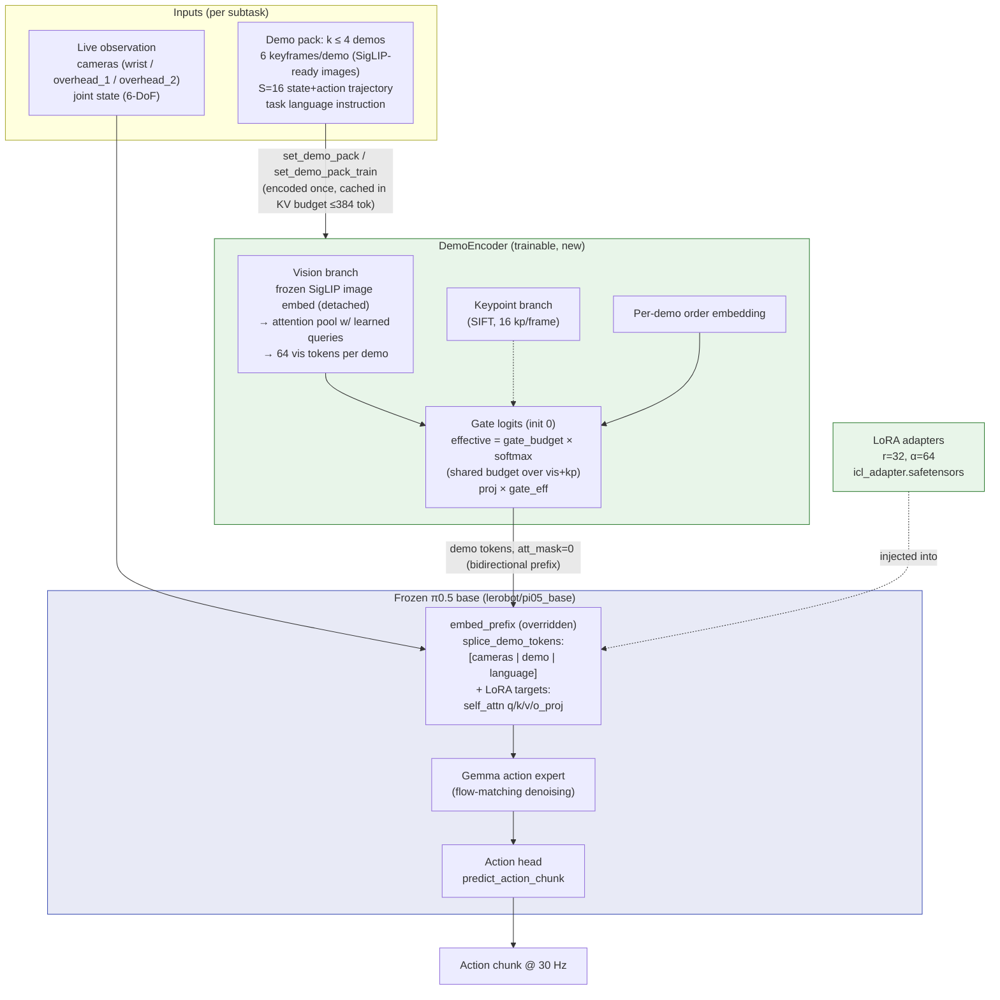
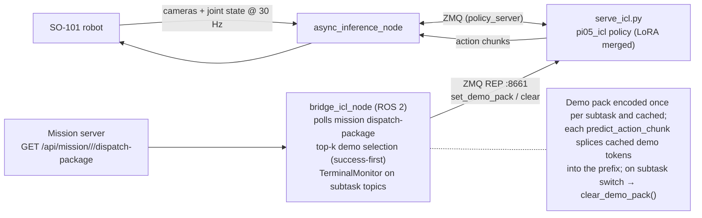

# SO101 ICL — Architecture

In-context learning for the SO-101 arm: a demo-conditioned **π0.5** VLA policy (`pi05_icl`).
A frozen `lerobot/pi05_base` (PaliGemma-3B VLM + Gemma action expert, flow matching) is
extended with a trainable **DemoEncoder**, **LoRA adapters**, and **learned gates** whose
output is spliced into the transformer prefix as extra in-context tokens.

## Model architecture

## Training pipeline (two stages)

```mermaid
flowchart LR
    S1["Stage 1: DROID pretrain<br/>lerobot/droid_1.0.1 subset<br/>(configs/icl_pretrain_droid_v1.yaml)"] --> ADPT["Stage-1 adapter<br/>(best/ selected on the<br/>held-out demo/zeroed ratio)"]
    ADPT -->|"init_adapter_from<br/>(rank/alpha/demo_encoder<br/>validated against the adapter meta<br/>on load — mismatch refuses;<br/>vlm_attention may widen to +expert)"| S2["Stage 2: SO-101 finetune<br/>rosbag_to_lerobot exports, 30 Hz<br/>(configs/icl_finetune_so101_v1.yaml)"]

    subgraph loop["train_loop.run_training (Accelerate DDP, bf16)"]
        DS["ICLDataset<br/>supports = same task CLUSTER as query<br/>(embedded task strings; string/category fallback)<br/>k∈1..4, BurstyGroupBatchSampler"]
        ENC["set_demo_pack_train<br/>(DemoEncoder in-graph)"]
        LOSS["Flow-matching loss + usage hinge<br/>L = loss_fm + w·relu(loss − loss_zeroed + margin)<br/>language dropout, curriculum"]
        OPT["AdamW: LoRA + DemoEncoder + gates only<br/>(gates at lr × train.gate_lr_mult)"]
        SEL["val: held-out demos-on vs gates-zeroed<br/>→ best/ on the ratio (M2 signal)<br/>every ckpt: adapter + trainer_state.pt<br/>(step/optimizer/scheduler/RNG)"]
        DS --> ENC --> LOSS --> OPT
        OPT --> SEL
    end

    S1 --> loop
    S2 --> loop
    SEL --> MET["metrics.jsonl / tensorboard<br/>loss, demo_zeroed_ratio, val/demo_ratio,<br/>effective gate_vis/kp (sum = budget), lora_norm"]
```

Both stages share one init mechanism (`lora.setup_trainable_policy`): stage 1
starts from scratch and asserts structural zero-init (M0); stage 2 loads the
stage-1 adapter and skips those assertions (a trained adapter is by
definition not at zero). LoRA targets are discovered structurally — exact
module paths enumerated from the live model tree (VLM self-attention
q/k/v/o projections), so a lerobot version bump fails loudly at injection
instead of silently matching nothing. Checkpoints are resumable:
`--resume-from <ckpt dir>` restores step, optimizer, scheduler and RNG,
continuing the LR schedule; without trainer state the load is a warm
start (stage-2 semantics).

## Inference / serving (ROS 2 system view)

## Key modules

| Module | Role |
|---|---|
| `so101_icl/configuration_pi05_icl.py` | `ICLConfig(PI05Config)`, registered as `"pi05_icl"` |
| `so101_icl/modeling_pi05_icl.py` | `PI05ICLCore` / `PI05ICLPolicy`, `splice_demo_tokens`, serving checkpoint (LoRA merged) |
| `so101_icl/demo_encoder.py` | `DemoEncoder`: SigLIP vision pool, trajectory MLP, gates |
| `so101_icl/lora.py` | Structural LoRA target discovery, inject/save/load with strict adapter validation (widening `→ +expert` allowed), zero-init assert |
| `so101_icl/data.py` | `ICLDataset`, task registry, bursty batch sampler |
| `so101_icl/train_loop.py` | Training loop, usage-hinge loss, curriculum, ratio-based `best/` selection, resumable trainer state |
| `so101_icl/demo_transport.py` | ZMQ :8661 demo side channel |
| `so101_icl/bridge_icl_node.py` | ROS bridge: dispatch → demo pack |
